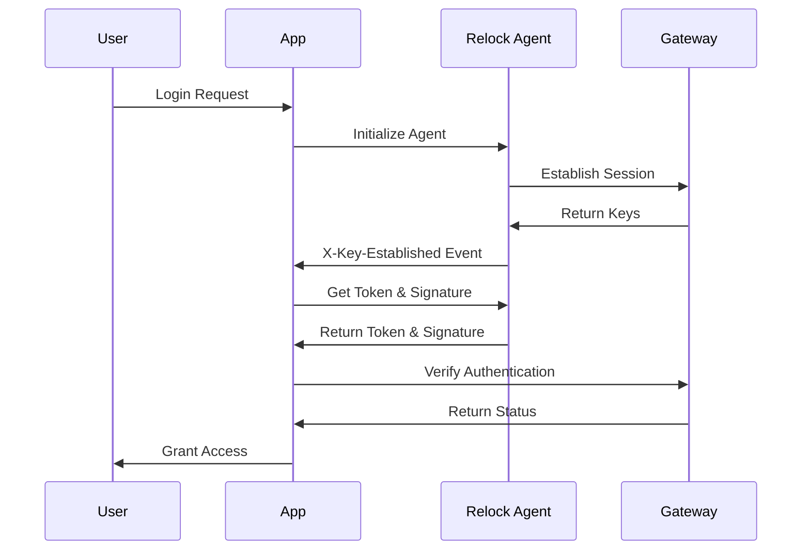

# API Reference

Complete reference for Relock's authentication APIs and endpoints.

## Overview

Relock provides APIs for different integration scenarios:

- **JavaScript Agent API** - Client-side authentication and token generation
- **Gateway API** - Server-side verification and user management

## Quick Start

### JavaScript Agent

```javascript
// Wait for Relock agent to be ready
window.addEventListener('X-Key-Established', async function (event) {
  // Get authentication token
  const token = await window.relock.token();
  
  // Sign the token
  const signature = await window.relock.sign(token);
  
  // Use for API calls
  console.log('Token:', token);
  console.log('Signature:', signature);
});
```

### Server-side Verification

```javascript
// Verify authentication on your backend
const response = await fetch('/relock/confirm', {
  method: 'POST',
  headers: {
    'Content-Type': 'application/json'
  },
  body: JSON.stringify({
    'X-Key-Token': token,
    'X-Key-Signature': signature,
    'X-Key-Session': sessionId
  })
});

const result = await response.json();
```

## Authentication Flow



## Status Codes

| Code | Description |
|------|-------------|
| **200 OK** | Authentication successful, user is signed in |
| **401 Unauthorized** | Missing or invalid authentication data |
| **406 Not Acceptable** | Re-keying in progress, retry required |
| **409 Conflict** | Token mismatch, re-authentication needed |
| **417 Expectation Failed** | Invalid signature |
| **404 Not Found** | Session not found |
| **410 Gone** | Session expired |

## Error Handling

All API responses include error details:

```json
{
  "success": false,
  "error": "Invalid signature",
  "status_code": 417,
  "status_info": "Signature verification failed"
}
```

## Next Steps

- [**JavaScript Agent API**](./js-agent-api) - Client-side integration
- [**Gateway API**](./gateway-api) - Server-side verification