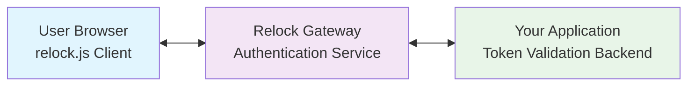
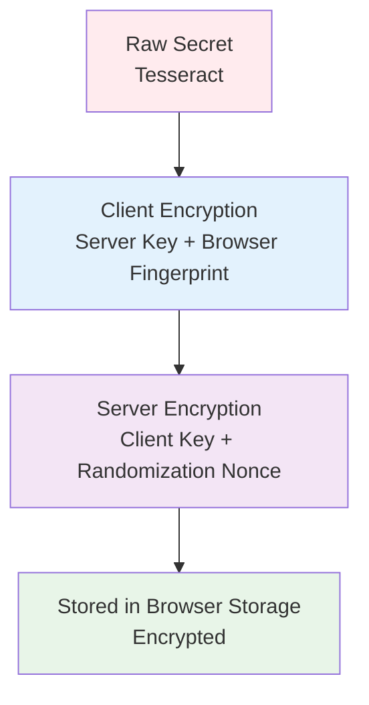
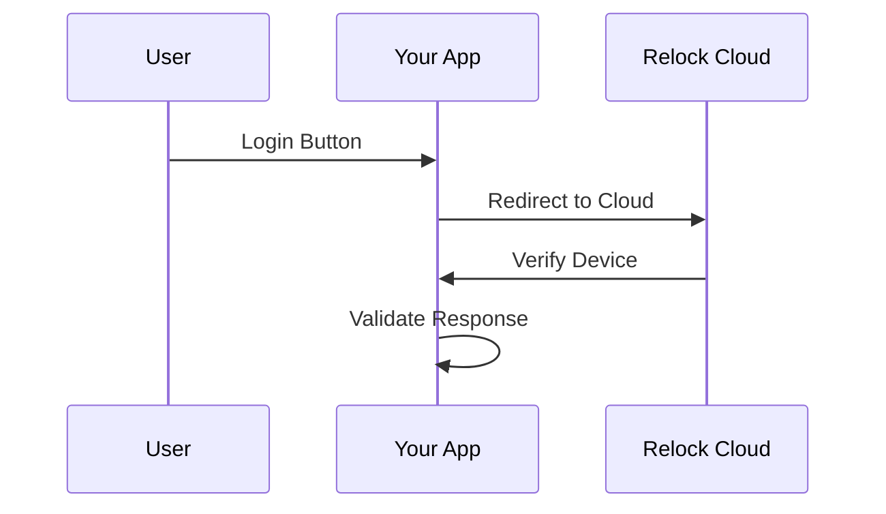
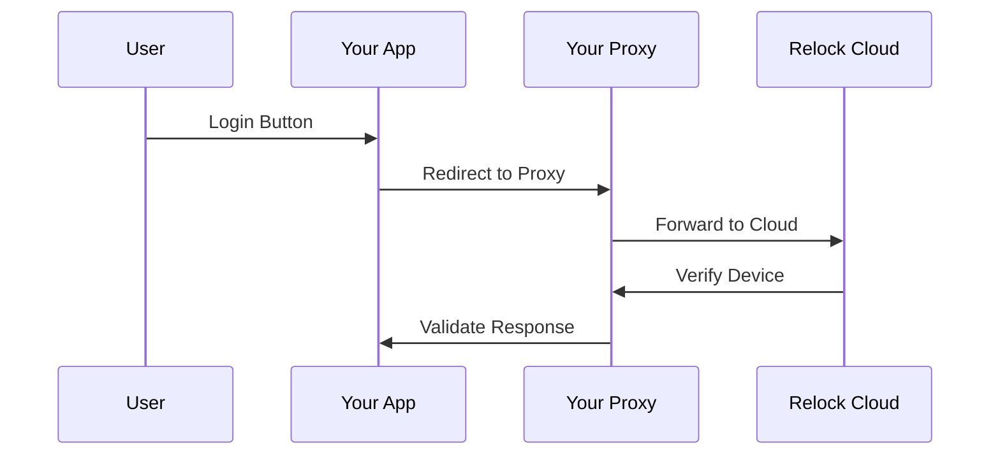
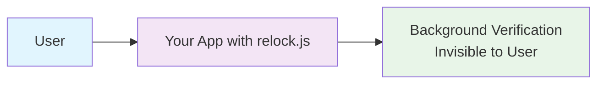

# How Relock Works

Relock's architecture is built around the principle of **continuous cryptographic trust** - replacing static bearer credentials with dynamic, per-request proofs that are bound to specific devices and origins.

## Core Architecture

### System Components

Relock consists of three main components:

1. **Relock Gateway**: Cloud-hosted authentication service
2. **JavaScript Agent**: Lightweight client-side library
3. **Your Application**: Web application with Relock integration

### Data Flow

## Cryptographic Foundation

### Relock Tesseract

The **Tesseract** is Relock's core cryptographic construct - a symmetric key wrapped in interdependent encryption:

#### Key Properties

- **Interdependent**: Neither client nor server can reconstruct the raw secret alone
- **Browser-bound**: Tied to specific browser sandbox and origin
- **Memory-only**: Raw secrets never stored in unencrypted form
- **Rotating**: Automatically refreshed to prevent reuse

#### Encryption Layers

### Key Derivation Process

1. **Initial Enrollment**: Client and server establish shared secret material
2. **Client Encryption**: Secret encrypted with server-only key + browser fingerprint
3. **Server Encryption**: Result encrypted with client-only key + randomization
4. **Storage**: Double-encrypted result stored in browser storage
5. **Access**: Decryption requires both client and server cooperation

## Authentication Flow

### Session Initialization

1. **Page Load**: `relock.js` loads and initializes
2. **Key Establishment**: Agent contacts Relock gateway
3. **Device Verification**: Gateway validates browser environment
4. **Tesseract Creation**: New cryptographic material established
5. **Event Fired**: `X-Key-Established` event signals readiness

### Per-Request Authentication

1. **Token Generation**: Agent derives fresh token from Tesseract
2. **Signature Creation**: Ed25519 signature of token with device key
3. **Request Transmission**: Token + signature sent with request
4. **Backend Validation**: Your app verifies with Relock gateway
5. **Response Processing**: Validated request proceeds

### Key Rotation

1. **Automatic Rotation**: Keys rotate based on policy (session start, time, per-request)
2. **Rotation Trigger**: Server may trigger rotation after token verification
3. **New Material**: Fresh Tesseract established with new encryption layers
4. **Event Notification**: `X-Key-Rekeying-Done` event signals completion

## Security Mechanisms

### Origin Binding

Relock enforces strict origin validation:

- **Protocol**: HTTPS only (no HTTP downgrade)
- **Domain**: Exact domain match required
- **Subdomain**: Subdomain isolation enforced
- **Port**: Standard ports (443, 80) only

### Device Binding

Multiple layers of device identification:

- **Browser Sandbox**: Process isolation enforcement
- **OS Keychain**: Platform security integration
- **Browser Fingerprint**: Hardware and software characteristics
- **Storage Isolation**: Origin-based data separation

### Replay Prevention

Built-in protection against token reuse:

- **Single-Use Tokens**: Each token valid for exactly one request
- **Server-Side Tracking**: Gateway monitors token usage
- **Immediate Detection**: Reuse triggers session termination
- **Audit Logging**: All reuse attempts logged for analysis

## Integration Patterns

### Simple Integration

### SameSite Integration

### JavaScript Agent

## Cryptographic Algorithms

### Symmetric Encryption

- **Algorithm**: AES-256-GCM
- **Key Size**: 256 bits
- **Mode**: Galois/Counter Mode for authenticated encryption
- **Purpose**: Tesseract encryption and decryption

### Asymmetric Signatures

- **Algorithm**: Ed25519
- **Key Size**: 256 bits (public), 512 bits (private)
- **Purpose**: Control plane authentication and token signatures
- **Benefits**: Fast, secure, compact signatures

### Key Derivation

- **Algorithm**: HKDF (HMAC-based Key Derivation Function)
- **Hash Function**: SHA-256
- **Purpose**: Deriving per-request tokens from Tesseract
- **Properties**: Deterministic, collision-resistant

## Performance Characteristics

### Latency

- **Initial Setup**: 100-500ms (first visit)
- **Subsequent Requests**: 1-10ms (token generation)
- **Gateway Validation**: 50-200ms (network round-trip)
- **Overall Impact**: Minimal user-perceivable delay

### Throughput

- **Token Generation**: 10,000+ tokens/second
- **Signature Creation**: 5,000+ signatures/second
- **Gateway Capacity**: Scales automatically with demand
- **Client Resources**: Minimal CPU and memory usage

### Scalability

- **Horizontal Scaling**: Gateway scales automatically
- **Load Distribution**: Global CDN for optimal performance
- **Rate Limiting**: Configurable per-gateway limits
- **DDoS Protection**: Built-in attack mitigation

## Security Assumptions

### Trust Model

Relock's security relies on:

1. **Browser Security**: Origin isolation and sandboxing
2. **TLS Integrity**: Secure communication channels
3. **OS Security**: Keychain and process isolation
4. **Network Security**: Reliable internet connectivity

### Threat Model

Relock protects against:

- **Session Hijacking**: Stolen cookies and tokens
- **Token Replay**: Multiple use of captured tokens
- **Man-in-the-Middle**: Real-time interception attacks
- **Origin Spoofing**: Cross-site request forgery

### Limitations

Relock cannot protect against:

- **XSS Attacks**: Same-origin code execution
- **Malware**: Full device compromise
- **Social Engineering**: User deception
- **Network Attacks**: Infrastructure-level attacks

## Monitoring and Observability

### Event System

Relock provides rich event data:

- **`X-Key-Established`**: Keys ready for use
- **`X-Key-Rekeying-Done`**: Rotation completed
- **`X-Key-View-Change`**: SPA navigation detected

### Audit Logging

Comprehensive security monitoring:

- **Authentication Events**: Login, logout, session changes
- **Security Incidents**: Failed verifications, reuse attempts
- **Performance Metrics**: Response times, throughput
- **Compliance Data**: Audit trails for regulatory requirements

## Next Steps

- **Understand** the [security model](./security-model)
- **Compare** with [alternative solutions](./comparison)
- **Learn** about [integration patterns](../integration/integration-overview)
- **Start implementing** with our [quickstart guides](../getting-started/quickstart-overview)
