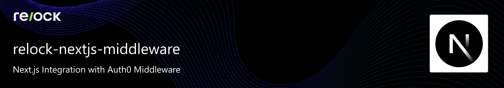

# 

A complete Next.js application demonstrating how to integrate [Relock](https://relock.host) cryptographic authentication with Auth0 using middleware for server-side authentication handling.

## 🔐 What This Example Demonstrates

- **Production-Ready Authentication**: Robust dual authentication with Auth0 + Relock
- **Server-Side Security**: Middleware-based authentication handling for maximum security
- **Real-time Monitoring**: Live authentication state with comprehensive status tracking
- **Enterprise Features**: HTTPS support, comprehensive error handling, retry logic
- **Modern Architecture**: TypeScript, App Router, responsive design with Tailwind CSS

## 🚀 Quick Start

### Prerequisites

- **Node.js 20+** (LTS recommended)
- **Auth0 Account** - [Sign up for free](https://auth0.com)
- **Relock Account** - [Get started at relock.host](https://relock.host)

### 1. Clone and Install

```bash
git clone https://github.com/relock-security/relock-examples.git
cd relock-examples/nextjs/relock-nextjs-middleware
npm install
```

### 2. Environment Setup

Create a `.env.local` file with the following variables:

```properties
# Auth0 Configuration
AUTH0_DOMAIN=your-tenant.auth0.com
AUTH0_CLIENT_ID=your-client-id
AUTH0_CLIENT_SECRET=your-client-secret
AUTH0_SECRET=your-32-character-secret

# Application Configuration
APP_BASE_URL=http://localhost:3000

# Relock Configuration
RELOCK_GATEWAY_UUID=your-gateway-uuid
```

### 3. Generate Required Secrets

```bash
# Generate AUTH0_SECRET (32 characters)
openssl rand -hex 32
```

### 4. Auth0 Application Setup

1. **Create Auth0 Application**:
   - Go to [Auth0 Dashboard](https://manage.auth0.com)
   - Create a new **Regular Web Application**
   - Note down your `Domain`, `Client ID`, and `Client Secret`

2. **Configure URLs**:
   - **Allowed Callback URLs**: `http://localhost:3000/auth/callback`
   - **Allowed Logout URLs**: `http://localhost:3000`
   - **Allowed Web Origins**: `http://localhost:3000`

### 5. Run the Application

```bash
npm run dev
```

Visit `http://localhost:3000` to see the application in action!

## 🔒 HTTPS Development Setup

For local HTTPS development, the example includes experimental Next.js HTTPS configuration:

### 1. Generate Self-Signed Certificates

```bash
# Create certs directory
mkdir certs
cd certs

# Create and Install a new Local CA
mkcert -install

# Generate certificate
mkcert relock.dev
```

### 2. Update Environment Variables

```properties
APP_BASE_URL=https://relock.dev:3000
```

### 3. Run with HTTPS

```bash
npm run dev
# Visit https://relock.dev:3000
```

## 🏗️ Architecture

This example demonstrates:

- **Next.js App Router** with TypeScript
- **Auth0 Next.js SDK** for user authentication
- **Relock JavaScript Agent** for cryptographic verification
- **Middleware** for server-side authentication handling
- **React Context** for state management
- **Tailwind CSS** for styling

## 📁 Key Files

- `src/middleware.ts` - Authentication middleware
- `src/components/RelockAuthProvider.tsx` - Auth state management
- `src/components/RelockAuthHandler.tsx` - Relock integration
- `src/lib/auth0.ts` - Auth0 configuration
- `src/app/layout.tsx` - Root layout with providers

## 🔗 GitHub Repository

**Source Code**: [relock-security/relock-examples/nextjs/relock-nextjs-middleware](https://github.com/relock-security/relock-examples/tree/main/nextjs/relock-nextjs-middleware)
