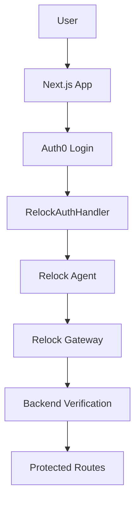

# Next.js Integration

Complete example of integrating Relock with Next.js using middleware and Auth0 for user management.

## Overview

This integration demonstrates:
- **Dual Authentication**: Auth0 for user management + Relock for cryptographic security
- **Middleware Integration**: Server-side authentication handling
- **Real-time Status**: Live authentication state monitoring
- **Error Handling**: Comprehensive retry logic and user feedback
- **TypeScript Support**: Full type safety throughout

## Prerequisites

- Node.js 20+ (LTS recommended)
- Auth0 account ([sign up for free](https://auth0.com))
- Relock account ([get started at relock.host](https://relock.host))
- Next.js 14+ with App Router

## Quick Start

### 1. Clone the Example

```bash
git clone <repository-url>
cd relock-examples/nextjs/relock-nextjs-middleware
npm install
```

### 2. Environment Setup

Create a `.env.local` file:

```env
# Auth0 Configuration
AUTH0_DOMAIN=your-tenant.auth0.com
AUTH0_CLIENT_ID=your-client-id
AUTH0_CLIENT_SECRET=your-client-secret
AUTH0_SECRET=your-32-character-secret

# Application Configuration
APP_BASE_URL=http://localhost:3000

# Relock Configuration
RELOCK_GATEWAY_UUID=your-gateway-uuid
```

### 3. Generate Required Secrets

```bash
# Generate AUTH0_SECRET (32 characters)
openssl rand -hex 32
```

### 4. Auth0 Setup

1. Create a new **Regular Web Application** in Auth0 Dashboard
2. Configure URLs:
   - **Allowed Callback URLs**: `http://localhost:3000/auth/callback`
   - **Allowed Logout URLs**: `http://localhost:3000`
   - **Allowed Web Origins**: `http://localhost:3000`

### 5. Run the Application

```bash
npm run dev
```

Visit `http://localhost:3000` to see the application in action!

## Architecture Overview



## Key Components

### RelockAuthProvider

Context provider for managing Relock authentication state:

```typescript
interface RelockAuthState {
  attempted: boolean;
  success: boolean;
  error?: string;
  retryCount: number;
}
```

### RelockAuthHandler

Background component that handles authentication after Auth0 login:

```typescript
export default function RelockAuthHandler() {
  const { user, isLoading } = useUser();
  const { getToken, signToken } = useRelock();
  const { setState, resetState } = useRelockAuthActions();

  // Handles automatic Relock authentication
  // when Auth0 user is available
}
```

### RelockEventsProvider

Manages Relock agent events and provides token/signature generation:

```typescript
export function RelockEventsProvider({ children }: { children: ReactNode }) {
  // Listens for X-Key-Established events
  // Provides getToken() and signToken() functions
}
```

## Implementation Details

### 1. Middleware Setup

Create `middleware.ts` in your project root:

```typescript
import { withMiddlewareAuthRequired } from '@auth0/nextjs-auth0/edge';

export default withMiddlewareAuthRequired();

export const config = {
  matcher: ['/dashboard/:path*', '/api/protected/:path*']
};
```

### 2. Reverse Proxy Configuration

Configure your reverse proxy to route `/relock/*` to Relock:

```nginx
location /relock/ {
  proxy_pass https://relock.host/;
  proxy_set_header Host relock.host;
  proxy_set_header X-Key-Wildcard "your-gateway-uuid";
  proxy_set_header X-Forwarded-For $proxy_add_x_forwarded_for;
  proxy_set_header X-Forwarded-Proto $scheme;
}
```

### 3. JavaScript Agent Integration

Include the Relock agent in your `_app.tsx` or layout:

```typescript
export default function RootLayout({ children }: { children: ReactNode }) {
  return (
    <html lang="en">
      <head>
        <script src="/relock/relock.js" async></script>
      </head>
      <body>
        <UserProvider>
          <RelockAuthProvider>
            <RelockEventsProvider>
              {children}
            </RelockEventsProvider>
          </RelockAuthProvider>
        </UserProvider>
      </body>
    </html>
  );
}
```

### 4. Authentication Flow

The authentication flow works as follows:

1. **User logs in with Auth0** → Auth0 handles user authentication
2. **RelockAuthHandler detects Auth0 user** → Automatically triggers Relock authentication
3. **Relock agent generates tokens** → Cryptographic proof of device identity
4. **Backend verifies tokens** → Server-side validation of authentication
5. **User gains access** → Protected routes become available

### 5. Request Verification

Verify authentication on protected routes:

```typescript
// pages/api/protected/example.ts
import { withApiAuthRequired, getSession } from '@auth0/nextjs-auth0';

export default withApiAuthRequired(async function handler(req, res) {
  const session = await getSession(req, res);
  
  // Verify Relock authentication
  const relockToken = req.headers['x-key-token'] as string;
  const relockSignature = req.headers['x-key-signature'] as string;
  
  if (!relockToken || !relockSignature) {
    return res.status(401).json({ error: 'Relock authentication required' });
  }
  
  // Verify with Relock gateway
  const verification = await verifyWithRelock(relockToken, relockSignature);
  
  if (!verification.valid) {
    return res.status(401).json({ error: 'Invalid Relock authentication' });
  }
  
  res.json({ message: 'Access granted', user: session.user });
});
```

## Advanced Features

### Multi-Tab Support

Relock natively supports multi-tab browsing:

```typescript
// Each tab gets a unique identifier
// Tokens cannot be replayed across tabs
// Race conditions are automatically handled
```

### Automatic Re-keying

The system automatically handles key rotation:

```typescript
// Listen for re-keying events
window.addEventListener('X-Key-Rekeying-Done', function (event) {
  console.log('Key rotation completed:', event.detail);
});
```

### Error Handling and Retry Logic

Comprehensive retry logic for network issues:

```typescript
const attemptRelockLogin = useCallback(async (retryCount = 0) => {
  try {
    // Attempt authentication
    const response = await fetch('/relock/login', { /* ... */ });
    const result = await response.json();
    
    if (result.status_code === 406 && retryCount < 5) {
      // Re-keying in progress, retry with exponential backoff
      setTimeout(() => {
        attemptRelockLogin(retryCount + 1);
      }, (retryCount + 1) * 2000);
    }
  } catch (error) {
    // Handle errors appropriately
  }
}, [/* dependencies */]);
```

## Security Considerations

### Content Security Policy

Implement strict CSP with nonces:

```typescript
// middleware.ts
export function middleware(request: NextRequest) {
  const nonce = crypto.randomBytes(16).toString('base64');
  
  const response = NextResponse.next();
  response.headers.set(
    'Content-Security-Policy',
    `default-src 'self'; script-src 'self' 'nonce-${nonce}' 'strict-dynamic'; connect-src 'self' https://relock.host;`
  );
  
  return response;
}
```

### HTTPS Configuration

For local development with HTTPS:

```bash
# Generate certificates
mkcert -install
mkcert relock.dev

# Update package.json
{
  "scripts": {
    "dev": "next dev --experimental-https --experimental-https-key ./certs/relock.dev-key.pem --experimental-https-cert ./certs/relock.dev.pem --hostname relock.dev"
  }
}
```

## Production Deployment

### Environment Variables

```env
# Production environment
AUTH0_DOMAIN=your-tenant.auth0.com
AUTH0_CLIENT_ID=your-client-id
AUTH0_CLIENT_SECRET=your-client-secret
AUTH0_SECRET=your-32-character-secret
APP_BASE_URL=https://your-domain.com
RELOCK_GATEWAY_UUID=your-gateway-uuid
```

### Reverse Proxy Configuration

```nginx
# Production Nginx configuration
server {
    listen 443 ssl http2;
    server_name your-domain.com;
    
    ssl_certificate /path/to/certificate.crt;
    ssl_certificate_key /path/to/private.key;
    
    # HSTS
    add_header Strict-Transport-Security "max-age=63072000; includeSubDomains; preload" always;
    
    # Relock proxy
    location /relock/ {
        proxy_pass https://relock.host/;
        proxy_set_header Host relock.host;
        proxy_set_header X-Key-Wildcard "your-gateway-uuid";
        proxy_set_header X-Forwarded-For $proxy_add_x_forwarded_for;
        proxy_set_header X-Forwarded-Proto $scheme;
    }
    
    # Next.js application
    location / {
        proxy_pass http://localhost:3000;
        proxy_http_version 1.1;
        proxy_set_header Upgrade $http_upgrade;
        proxy_set_header Connection 'upgrade';
        proxy_set_header Host $host;
        proxy_cache_bypass $http_upgrade;
    }
}
```

## Troubleshooting

### Common Issues

**Auth0 integration not working**
- Check environment variables
- Verify callback URLs in Auth0 dashboard
- Ensure AUTH0_SECRET is properly set

**Relock authentication failing**
- Verify reverse proxy configuration
- Check gateway UUID is correct
- Review browser console for errors

**TypeScript errors**
- Ensure all dependencies are installed
- Check type definitions are up to date
- Verify import paths are correct

### Debug Mode

Enable debug logging:

```typescript
// Enable Relock debug mode
if (typeof window !== 'undefined') {
  window.relock.debug = true;
}
```

## Next Steps

- Learn about [JavaScript Agent Integration](./js-agent-integration) for other frameworks
- Check the [API Reference](../api) for technical details
- Review [Security Best Practices](../security/best-practices) for production deployment
