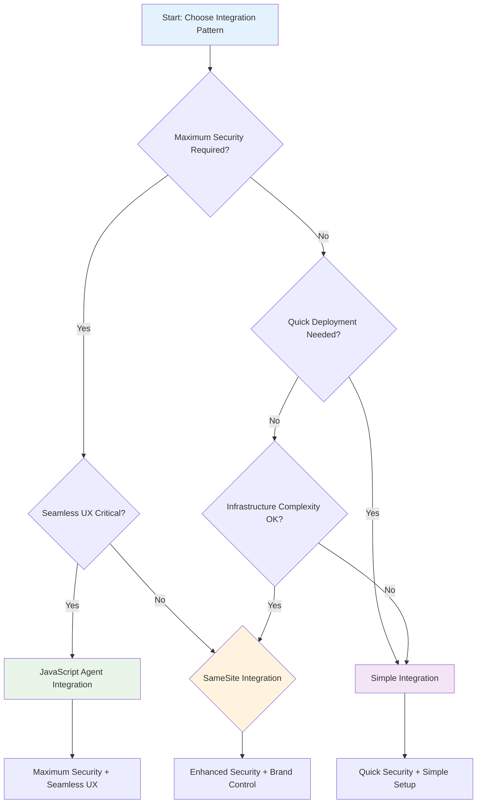

# Integration Patterns Overview

Choose the right Relock integration pattern based on your security requirements, user experience needs, and infrastructure capabilities.

## Integration Pattern Decision Tree

## Integration Pattern Comparison

| Feature | Simple Integration | SameSite Integration | JavaScript Agent |
|---------|-------------------|---------------------|------------------|
| **Security Level** | High | Higher | Highest |
| **User Experience** | Good | Better | Best |
| **Implementation** | Simple | Moderate | Complex |
| **Infrastructure** | None | Reverse Proxy | Reverse Proxy |
| **Deployment Time** | 30 minutes | 2-4 hours | 1-2 days |
| **Maintenance** | None | Low | Medium |
| **Compliance** | Enterprise | Enterprise+ | Enterprise++ |

## 🚀 Simple Integration (Cloud Redirect)

**Best for**: Quick deployment, maximum security, minimal infrastructure

### When to Choose Simple Integration

- **Rapid deployment** is needed
- **Infrastructure complexity** should be minimized
- **Maximum security** is required
- **Compliance standards** must be met quickly
- **Authentication complexity** should be minimized

### Key Benefits

- **Zero Infrastructure**: No reverse proxy or additional servers
- **Maximum Security**: Complete isolation from authentication logic
- **Compliance Ready**: Meets enterprise security requirements
- **Maintenance Free**: No authentication code to maintain
- **Scalable**: Relock gateway handles all authentication load

### Limitations

- **User Experience**: Redirect flow may interrupt user workflow
- **Network Dependency**: Requires reliable internet connectivity
- **Branding**: Authentication occurs on Relock domain
- **Customization**: Limited control over authentication flow

### Use Cases

- **MVP Applications**: Quick security wins
- **Enterprise Applications**: Compliance-focused deployments
- **Legacy Systems**: Minimal code changes required
- **High-Security Applications**: Maximum security isolation

## 🔒 SameSite Integration (Proxy-based)

**Best for**: Brand control, enhanced security, existing proxy infrastructure

### When to Choose SameSite Integration

- **Branding control** is important
- **Enhanced security** through proxy is desired
- **Custom security policies** are needed
- **Complete audit trail** is required
- **Enterprise compliance** standards must be met

### Key Benefits

- **Brand Consistency**: Users never leave your domain
- **Enhanced Security**: Proxy provides additional security layer
- **Customizable**: Proxy can implement custom security policies
- **Audit Trail**: Complete logging of all authentication events
- **First-party Cookies**: Better browser security policies

### Limitations

- **Infrastructure Complexity**: Requires reverse proxy setup and maintenance
- **Security Responsibility**: Proxy security is your responsibility
- **Configuration Overhead**: Proxy must be properly configured
- **Performance Impact**: Additional network hop for authentication

### Use Cases

- **Brand-Conscious Applications**: User trust and branding important
- **Enterprise Applications**: Enhanced security requirements
- **Applications with Existing Proxies**: Leverage existing infrastructure
- **Compliance-Focused Organizations**: Complete audit requirements

## 🎯 JavaScript Agent Integration (Client-side)

**Best for**: Maximum security, seamless user experience, advanced applications

### When to Choose JavaScript Agent Integration

- **Seamless user experience** is critical
- **Maximum security** is required
- **Real-time authentication updates** are needed
- **Custom authentication UI** is desired
- **Enterprise compliance** standards must be met
- **Single-page applications** are used

### Key Benefits

- **Seamless Experience**: No redirects or page interruptions
- **Maximum Security**: Continuous device verification with cryptographic proofs
- **Real-time Updates**: Immediate response to security state changes
- **Customizable**: Full control over authentication UI and flow
- **Performance**: Minimal latency for authentication operations

### Limitations

- **Complexity**: Requires understanding of cryptographic concepts
- **Browser Requirements**: Modern browser with cryptographic support needed
- **JavaScript Security**: Vulnerable to XSS attacks if not properly implemented
- **Maintenance**: Requires ongoing security updates and monitoring

### Use Cases

- **High-Security Applications**: Maximum security requirements
- **Modern Web Applications**: Single-page applications and PWAs
- **User Experience Focused**: Seamless authentication critical
- **Advanced Security Organizations**: Cryptographic expertise available

## Decision Factors

### Security Requirements

| Security Level | Recommended Pattern | Reasoning |
|----------------|---------------------|-----------|
| **Basic** | Simple Integration | Provides enterprise-grade security with minimal complexity |
| **Enhanced** | SameSite Integration | Adds proxy security layer and custom policies |
| **Maximum** | JavaScript Agent | Continuous verification with cryptographic proofs |

### User Experience Requirements

| UX Priority | Recommended Pattern | Reasoning |
|-------------|---------------------|-----------|
| **Functional** | Simple Integration | Redirects are acceptable for basic functionality |
| **Branded** | SameSite Integration | Maintains domain consistency and branding |
| **Seamless** | JavaScript Agent | No interruptions or redirects |

### Infrastructure Capabilities

| Infrastructure | Recommended Pattern | Reasoning |
|----------------|---------------------|-----------|
| **Minimal** | Simple Integration | No additional infrastructure required |
| **Basic** | SameSite Integration | Reverse proxy configuration needed |
| **Advanced** | JavaScript Agent | Proxy + JavaScript security expertise |

### Compliance Requirements

| Compliance Level | Recommended Pattern | Reasoning |
|------------------|---------------------|-----------|
| **Basic** | Simple Integration | Meets enterprise security standards |
| **Enhanced** | SameSite Integration | Additional audit and monitoring capabilities |
| **Maximum** | JavaScript Agent | Complete security controls and verification |

## Migration Path

Start with Simple Integration and upgrade over time:

### Phase 1: Simple Integration
- **Goal**: Quick security wins and compliance
- **Timeline**: 30 minutes to deploy
- **Focus**: Basic security and compliance

### Phase 2: SameSite Integration
- **Goal**: Enhanced security and branding control
- **Timeline**: 2-4 hours to configure
- **Focus**: Proxy security and user experience

### Phase 3: JavaScript Agent
- **Goal**: Maximum security and seamless UX
- **Timeline**: 1-2 days to implement
- **Focus**: Advanced security and performance

## Implementation Timeline

| Pattern | Development | Testing | Deployment | Total |
|---------|-------------|---------|------------|-------|
| **Simple Integration** | 15 min | 10 min | 5 min | **30 min** |
| **SameSite Integration** | 1 hour | 2 hours | 1 hour | **4 hours** |
| **JavaScript Agent** | 4 hours | 6 hours | 2 hours | **12 hours** |

## Next Steps

### For Simple Integration
- **Quick Start**: [Simple Integration Quickstart](../getting-started/quickstart-cloud)
- **Reference**: [Simple Integration Reference](./simple-integration.md)

### For SameSite Integration
- **Quick Start**: [SameSite Integration Quickstart](../getting-started/quickstart-samesite)
- **Reference**: [SameSite Integration Reference](./samesite-integration.md)

### For JavaScript Agent
- **Quick Start**: [JavaScript Agent Quickstart](../getting-started/quickstart-js-agent)
- **Reference**: [JavaScript Agent Reference](./js-agent-integration.md)

### General Resources
- **Architecture**: [How Relock Works](../concepts/how-it-works)
- **Security**: [Security Model](../concepts/security-model)
- **API Reference**: [API Reference](./api-reference.md)

## Need Help Choosing?

Still unsure which pattern to choose? Consider these questions:

1. **How quickly do you need to deploy?**
   - **Immediate**: Simple Integration
   - **Within a day**: SameSite Integration
   - **Within a week**: JavaScript Agent

2. **What's your security expertise level?**
   - **Basic**: Simple Integration
   - **Intermediate**: SameSite Integration
   - **Advanced**: JavaScript Agent

3. **How important is user experience?**
   - **Functional**: Simple Integration
   - **Branded**: SameSite Integration
   - **Seamless**: JavaScript Agent

4. **What infrastructure do you have?**
   - **Minimal**: Simple Integration
   - **Basic**: SameSite Integration
   - **Advanced**: JavaScript Agent

---

**Ready to implement?** Choose your pattern and follow the corresponding quickstart guide!
