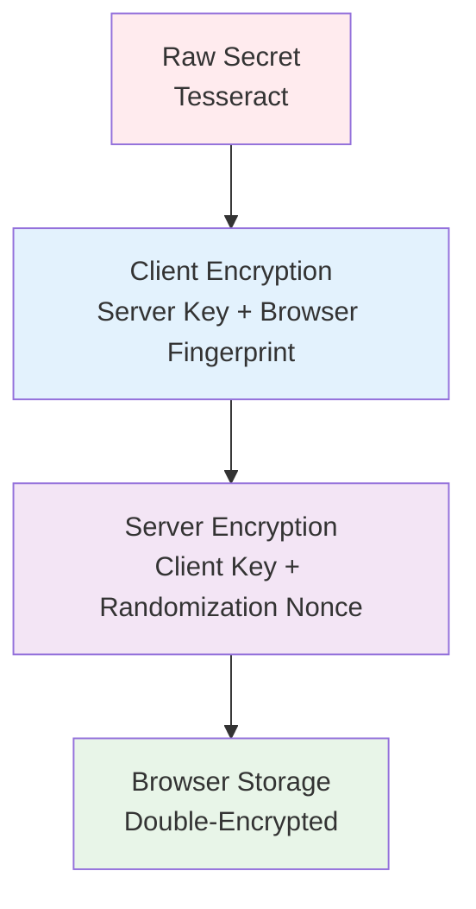
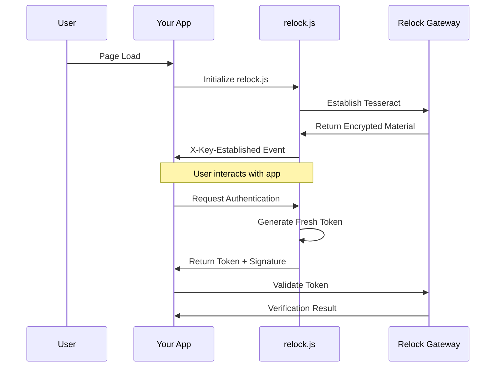

# JavaScript Agent Integration Reference

Complete architectural reference for Relock JavaScript Agent Integration (Client-side authentication).

## Overview

JavaScript Agent Integration embeds Relock's authentication directly into your web application using the `relock.js` library. This approach provides seamless user experience with continuous device verification while maintaining maximum security through cryptographic proofs.

## Security Model

### Trust Boundaries

JavaScript Agent Integration establishes sophisticated trust boundaries:

- **Your Application**: Handles user interface, business logic, and Relock integration
- **relock.js Library**: Manages cryptographic operations and device verification
- **Relock Gateway**: Performs device validation and token verification
- **User Browser**: Provides secure execution environment with cryptographic isolation
- **Browser Storage**: Securely stores encrypted cryptographic material

### Security Assumptions

1. **Browser Security**: Modern browser security features are available and enabled
2. **HTTPS Enforcement**: All communication must use TLS 1.3
3. **Origin Isolation**: Strict domain validation prevents cross-site attacks
4. **Cryptographic Isolation**: Browser provides secure random number generation
5. **Storage Security**: Browser storage is protected from cross-origin access
6. **JavaScript Integrity**: No malicious JavaScript execution in your application

### Threat Protection

JavaScript Agent Integration protects against:

- **Session Hijacking**: No persistent credentials stored in your application
- **Token Replay**: Single-use tokens with immediate validation
- **Cross-Site Request Forgery**: Origin validation and cryptographic signatures
- **Man-in-the-Middle**: TLS enforcement and cryptographic verification
- **XSS Attacks**: Cryptographic material protected from JavaScript access
- **Origin Spoofing**: Strict domain and protocol validation
- **Token Interception**: Ed25519 signatures prevent token tampering

## Cryptographic Architecture

### Relock Tesseract

The core cryptographic construct providing:

- **Interdependent Encryption**: Neither client nor server can reconstruct raw secrets
- **Browser Binding**: Tied to specific browser sandbox and origin
- **Memory Protection**: Raw secrets never stored in unencrypted form
- **Automatic Rotation**: Cryptographic material refreshed based on policy

### Encryption Layers

### Key Derivation Process

1. **Initial Enrollment**: Client and server establish shared secret material
2. **Client Encryption**: Secret encrypted with server-only key + browser fingerprint
3. **Server Encryption**: Result encrypted with client-only key + randomization
4. **Storage**: Double-encrypted result stored in browser storage
5. **Access**: Decryption requires both client and server cooperation

## Architecture

### Flow Overview

### Component Responsibilities

#### Your Application
- **Integration Management**: Initialize and configure relock.js
- **Event Handling**: Respond to Relock events and state changes
- **Token Management**: Use authentication tokens for API calls
- **Session Control**: Manage user sessions based on verification status
- **Error Handling**: Gracefully handle authentication failures

#### relock.js Library
- **Cryptographic Operations**: Manage Tesseract encryption and decryption
- **Device Verification**: Continuously validate browser environment
- **Token Generation**: Create fresh authentication tokens for each request
- **Event Management**: Fire events for authentication state changes
- **Storage Management**: Securely store encrypted cryptographic material

#### Relock Gateway
- **Device Validation**: Verify browser environment and device characteristics
- **Token Verification**: Validate authentication tokens and signatures
- **Cryptographic Operations**: Manage server-side encryption keys
- **Audit Logging**: Record all authentication events
- **Rate Limiting**: Prevent abuse and attacks

#### User Browser
- **Secure Execution**: Provide isolated execution environment
- **Cryptographic Support**: Enable cryptographic operations and secure random generation
- **Storage Isolation**: Maintain origin-based data separation
- **Network Security**: Enforce HTTPS and certificate validation
- **Origin Validation**: Enforce same-origin policy

## Integration Considerations

### Advantages

- **Seamless Experience**: No redirects or page interruptions
- **Maximum Security**: Continuous device verification with cryptographic proofs
- **Real-time Updates**: Immediate response to security state changes
- **Customizable**: Full control over authentication UI and flow
- **Compliance Ready**: Meets enterprise security requirements
- **Performance**: Minimal latency for authentication operations

### Limitations

- **Complexity**: Requires understanding of cryptographic concepts
- **Browser Requirements**: Modern browser with cryptographic support needed
- **JavaScript Security**: Vulnerable to XSS attacks if not properly implemented
- **Maintenance**: Requires ongoing security updates and monitoring
- **Debugging**: Cryptographic operations can be difficult to troubleshoot

### Use Cases

**Choose JavaScript Agent Integration when:**
- Seamless user experience is critical
- Maximum security is required
- Real-time authentication updates are needed
- Custom authentication UI is desired
- Enterprise compliance standards must be met
- Single-page applications are used

**Avoid JavaScript Agent Integration when:**
- Rapid deployment is needed
- Browser compatibility is limited
- JavaScript security expertise is not available
- Simple authentication is sufficient
- Network connectivity is unreliable

## Security Architecture

### Memory Protection

JavaScript Agent Integration implements multiple memory protection layers:

- **Encrypted Storage**: All cryptographic material is encrypted before storage
- **Memory Isolation**: Raw secrets never persist in unencrypted form
- **Garbage Collection**: Sensitive data is cleared from memory immediately
- **Process Isolation**: Browser sandbox provides additional isolation

### Event System

Rich event system for security monitoring:

- **`X-Key-Established`**: Cryptographic material ready for use
- **`X-Key-Rekeying-Done`**: Key rotation completed
- **`X-Key-View-Change`**: SPA navigation detected
- **`X-Key-Error`**: Authentication or cryptographic errors
- **`X-Key-Device-Change`**: Device characteristics changed

### Cryptographic Algorithms

- **Symmetric Encryption**: AES-256-GCM for Tesseract protection
- **Asymmetric Signatures**: Ed25519 for token verification
- **Key Derivation**: HKDF-SHA256 for token generation
- **Random Generation**: Browser's cryptographically secure random number generator

## Compliance & Security

### Regulatory Compliance

JavaScript Agent Integration supports:
- **SOC 2 Type II**: Complete audit trail and security controls
- **GDPR**: Minimal data collection and user consent
- **HIPAA**: Secure authentication without PHI exposure
- **PCI DSS**: No sensitive authentication data in your systems
- **ISO 27001**: Information security management
- **FIPS 140-2**: Cryptographic module validation

### Security Controls

- **Access Control**: Role-based permissions and least privilege
- **Audit Logging**: Comprehensive event recording and monitoring
- **Encryption**: End-to-end encryption of all sensitive data
- **Rate Limiting**: Protection against brute force attacks
- **Cryptographic Validation**: Prevention of token tampering
- **Origin Validation**: Cross-site attack prevention

### Risk Assessment

**Low Risk Factors:**
- No authentication secrets in your codebase
- Complete audit trail of all access attempts
- Continuous device verification
- Automatic cryptographic material rotation
- Professional security team monitoring

**Considerations:**
- JavaScript security implementation
- Browser compatibility requirements
- Cryptographic expertise needed
- XSS attack prevention
- Memory protection implementation

## Browser Requirements

### Minimum Requirements

- **HTTPS Support**: TLS 1.3 required
- **Cryptographic APIs**: Web Crypto API support
- **Storage APIs**: LocalStorage or IndexedDB support
- **Modern JavaScript**: ES2015+ support
- **Security Features**: Origin isolation and sandboxing

### Recommended Features

- **Hardware Security**: Secure enclave or TPM support
- **Advanced Storage**: IndexedDB with encryption support
- **Performance APIs**: High-resolution timing support
- **Security Headers**: CSP and HSTS support

## Next Steps

- **Implementation**: See [JavaScript Agent Quickstart](../getting-started/quickstart-js-agent)
- **Architecture**: Review [How Relock Works](../concepts/how-it-works)
- **Security**: Understand [Security Model](../concepts/security-model)
- **Comparison**: Evaluate [Integration Patterns](../integration-overview)
- **Deployment**: Review [Security Hardening](../deployment/security-hardening)
