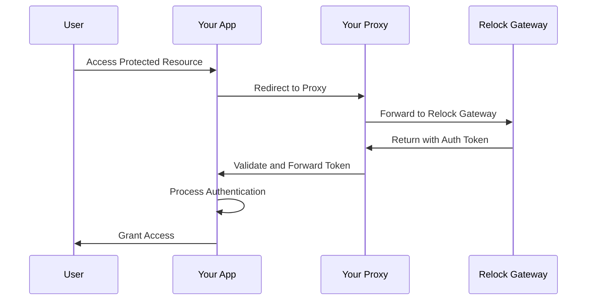

# SameSite Integration Reference

Complete architectural reference for Relock SameSite Integration (Proxy-based authentication).

## Overview

SameSite Integration uses a reverse proxy to handle Relock authentication while maintaining your domain in the browser address bar. This approach provides enhanced security through origin isolation while preserving user experience and branding control.

## Security Model

### Trust Boundaries

SameSite Integration establishes layered trust boundaries:

- **Your Application**: Handles user interface and business logic
- **Your Proxy**: Manages authentication routing and security headers
- **Relock Gateway**: Performs device verification and cryptographic operations
- **User Browser**: Provides secure execution environment with origin isolation

### Security Assumptions

1. **Proxy Security**: Your proxy infrastructure is trusted and secure
2. **HTTPS Enforcement**: All communication must use TLS 1.3
3. **Origin Isolation**: Strict domain validation prevents cross-site attacks
4. **Header Validation**: Proxy properly validates and forwards security headers
5. **Network Security**: Secure internal network between proxy and application

### Threat Protection

SameSite Integration protects against:

- **Session Hijacking**: No persistent credentials stored in your application
- **Token Replay**: Single-use tokens with immediate validation
- **Cross-Site Request Forgery**: Origin validation and SameSite cookies
- **Man-in-the-Middle**: TLS enforcement and certificate validation
- **Header Injection**: Proxy validation of all incoming headers
- **Origin Spoofing**: Strict domain and protocol validation

## Architecture

### Flow Overview



### Component Responsibilities

#### Your Application
- **Authentication Initiation**: Redirect users to your proxy
- **Token Validation**: Verify forwarded authentication tokens
- **Session Management**: Handle user sessions securely
- **Access Control**: Enforce authorization policies

#### Your Proxy
- **Request Routing**: Forward authentication requests to Relock
- **Header Management**: Add required security headers
- **Response Validation**: Verify Relock responses before forwarding
- **Security Enforcement**: Implement rate limiting and access controls
- **Audit Logging**: Record all proxy interactions

#### Relock Gateway
- **Device Verification**: Validate browser environment and device characteristics
- **Cryptographic Operations**: Generate and manage security tokens
- **Audit Logging**: Record all authentication events
- **Rate Limiting**: Prevent abuse and attacks

#### User Browser
- **Secure Execution**: Provide isolated execution environment
- **Storage Isolation**: Maintain origin-based data separation
- **Network Security**: Enforce HTTPS and certificate validation
- **Origin Validation**: Enforce same-origin policy

## Integration Considerations

### Advantages

- **Branding Control**: Authentication appears to happen on your domain
- **Enhanced Security**: Proxy provides additional security layer
- **Compliance Ready**: Meets enterprise security requirements
- **Customizable**: Proxy can implement custom security policies
- **Audit Trail**: Complete logging of all authentication events

### Limitations

- **Infrastructure Complexity**: Requires reverse proxy setup and maintenance
- **Security Responsibility**: Proxy security is your responsibility
- **Network Dependency**: Requires reliable internet connectivity
- **Configuration Overhead**: Proxy must be properly configured
- **Performance Impact**: Additional network hop for authentication

### Use Cases

**Choose SameSite Integration when:**
- Branding control is important
- Enhanced security through proxy is desired
- Custom security policies are needed
- Complete audit trail is required
- Enterprise compliance standards must be met

**Avoid SameSite Integration when:**
- Infrastructure complexity should be minimized
- Rapid deployment is needed
- Proxy security expertise is not available
- Network latency is critical

## Security Architecture

### Proxy Security Model

The proxy acts as a security gateway with:

- **Request Validation**: Verify all incoming requests
- **Header Sanitization**: Remove or validate security headers
- **Rate Limiting**: Prevent abuse and attacks
- **Access Control**: Enforce authentication requirements
- **Audit Logging**: Record all interactions

### Origin Binding

SameSite Integration enforces strict origin validation:

- **Protocol**: HTTPS only (no HTTP downgrade)
- **Domain**: Exact domain match required
- **Subdomain**: Subdomain isolation enforced
- **Port**: Standard ports (443, 80) only
- **Path**: Strict path validation

### Cookie Security

Enhanced cookie security through:

- **SameSite=Strict**: Prevents cross-site request forgery
- **Secure Flag**: HTTPS-only transmission
- **HttpOnly**: Prevents XSS attacks
- **Domain Binding**: Restricts cookie scope
- **Path Isolation**: Prevents path traversal

## Compliance & Security

### Regulatory Compliance

SameSite Integration supports:
- **SOC 2 Type II**: Complete audit trail and security controls
- **GDPR**: Minimal data collection and user consent
- **HIPAA**: Secure authentication without PHI exposure
- **PCI DSS**: No sensitive authentication data in your systems
- **ISO 27001**: Information security management

### Security Controls

- **Access Control**: Role-based permissions and least privilege
- **Audit Logging**: Comprehensive event recording and monitoring
- **Encryption**: End-to-end encryption of all sensitive data
- **Rate Limiting**: Protection against brute force attacks
- **Header Validation**: Prevention of header injection attacks
- **Origin Validation**: Cross-site attack prevention

### Risk Assessment

**Low Risk Factors:**
- No authentication secrets in your codebase
- Complete audit trail of all access attempts
- Proxy provides additional security layer
- Automatic security updates and patches
- Professional security team monitoring

**Considerations:**
- Proxy infrastructure security
- Network availability dependencies
- Browser security feature requirements
- Configuration complexity
- Maintenance overhead

## Network Topology

### Recommended Architecture

```
Internet → Load Balancer → Reverse Proxy → Your Application
                ↓              ↓              ↓
            SSL/TLS      Authentication    Business Logic
            Termination     Routing         & Sessions
```

### Security Zones

- **DMZ**: Load balancer and reverse proxy
- **Internal Network**: Your application servers
- **Isolation**: Strict network segmentation
- **Monitoring**: Comprehensive logging and alerting

## Next Steps

- **Implementation**: See [SameSite Integration Quickstart](../getting-started/quickstart-samesite)
- **Architecture**: Review [How Relock Works](../concepts/how-it-works)
- **Security**: Understand [Security Model](../concepts/security-model)
- **Deployment**: Review [Reverse Proxy Configuration](../deployment/reverse-proxy)
- **Comparison**: Evaluate [Integration Patterns](../integration-overview)
