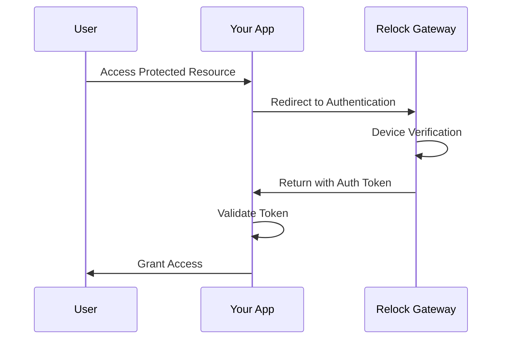

# Simple Integration Reference

Complete architectural reference for Relock Simple Integration (Cloud Redirect).

## Overview

Simple Integration redirects users to the Relock cloud domain for device verification, then returns them to your application with enhanced security. This approach provides the highest level of security isolation while maintaining simplicity of implementation.

## Security Model

### Trust Boundaries

Simple Integration establishes clear trust boundaries:

- **Your Application**: Handles user interface and business logic
- **Relock Gateway**: Manages device verification and cryptographic operations
- **User Browser**: Provides secure execution environment

### Security Assumptions

1. **HTTPS Enforcement**: All communication must use TLS 1.3
2. **Origin Isolation**: Strict domain validation prevents cross-site attacks
3. **Browser Security**: Relies on modern browser security features
4. **Network Integrity**: Assumes reliable internet connectivity

### Threat Protection

Simple Integration protects against:

- **Session Hijacking**: No persistent credentials stored in your application
- **Token Replay**: Single-use tokens with immediate validation
- **Cross-Site Request Forgery**: Origin validation and SameSite cookies
- **Man-in-the-Middle**: TLS enforcement and certificate validation

## Architecture

### Flow Overview

### Component Responsibilities

#### Your Application
- **Authentication Initiation**: Redirect users to Relock gateway
- **Token Validation**: Verify returned authentication tokens
- **Session Management**: Handle user sessions securely
- **Access Control**: Enforce authorization policies

#### Relock Gateway
- **Device Verification**: Validate browser environment and device characteristics
- **Cryptographic Operations**: Generate and manage security tokens
- **Audit Logging**: Record all authentication events
- **Rate Limiting**: Prevent abuse and attacks

#### User Browser
- **Secure Execution**: Provide isolated execution environment
- **Storage Isolation**: Maintain origin-based data separation
- **Network Security**: Enforce HTTPS and certificate validation

## Integration Considerations

### Advantages

- **Maximum Security**: Complete isolation from authentication logic
- **Compliance Ready**: Meets enterprise security requirements
- **Scalable**: Relock gateway handles all authentication load
- **Maintenance Free**: No authentication code to maintain

### Limitations

- **User Experience**: Redirect flow may interrupt user workflow
- **Network Dependency**: Requires reliable internet connectivity
- **Latency**: Additional round-trip for authentication
- **Branding**: Authentication occurs on Relock domain

### Use Cases

**Choose Simple Integration when:**
- Maximum security is required
- Compliance standards must be met
- Authentication complexity should be minimized
- Rapid deployment is needed

**Avoid Simple Integration when:**
- Seamless user experience is critical
- Offline operation is required
- Custom authentication UI is needed
- Network connectivity is unreliable

## Compliance & Security

### Regulatory Compliance

Simple Integration supports:
- **SOC 2 Type II**: Complete audit trail and security controls
- **GDPR**: Minimal data collection and user consent
- **HIPAA**: Secure authentication without PHI exposure
- **PCI DSS**: No sensitive authentication data in your systems

### Security Controls

- **Access Control**: Role-based permissions and least privilege
- **Audit Logging**: Comprehensive event recording and monitoring
- **Encryption**: End-to-end encryption of all sensitive data
- **Rate Limiting**: Protection against brute force attacks

### Risk Assessment

**Low Risk Factors:**
- No authentication secrets in your codebase
- Complete audit trail of all access attempts
- Automatic security updates and patches
- Professional security team monitoring

**Considerations:**
- Network availability dependencies
- Browser security feature requirements
- User training for authentication flow

## Next Steps

- **Implementation**: See [Simple Integration Quickstart](../getting-started/quickstart-cloud)
- **Architecture**: Review [How Relock Works](../concepts/how-it-works)
- **Security**: Understand [Security Model](../concepts/security-model)
- **Comparison**: Evaluate [Integration Patterns](../integration-overview)
