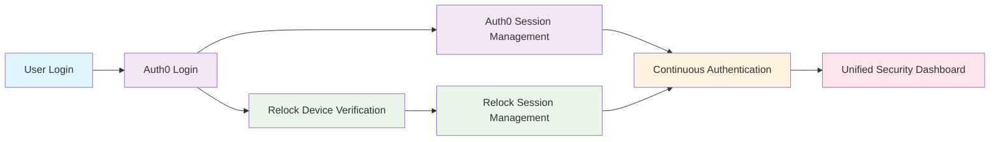
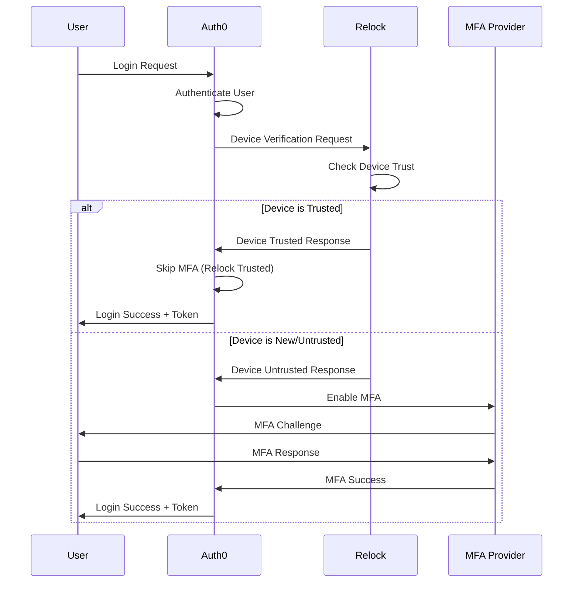
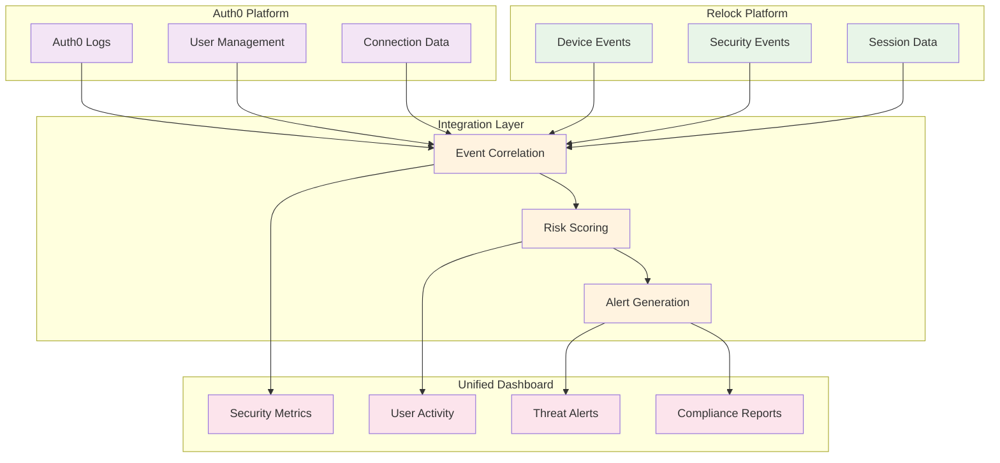
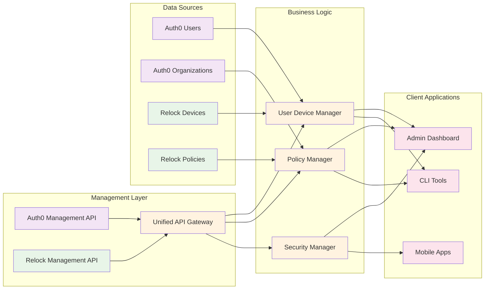
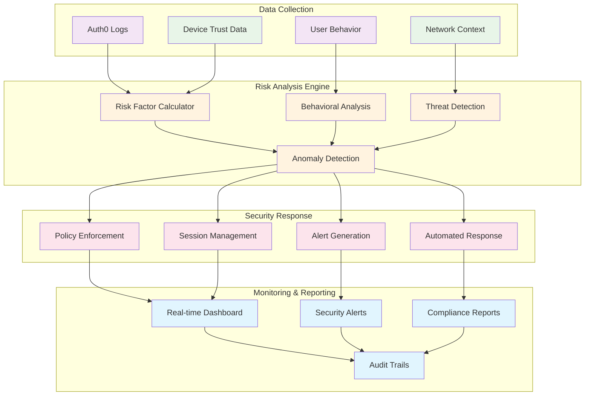
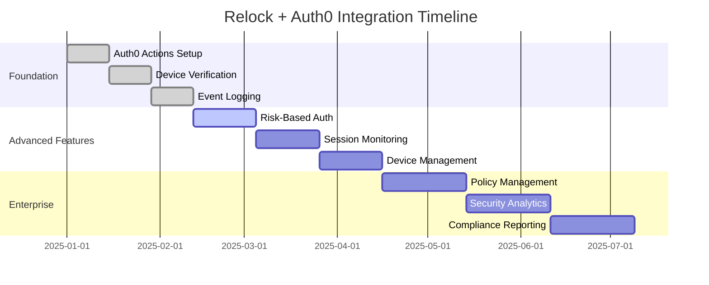

# Auth0 Integration Roadmap

Relock and Auth0 can work together to create a powerful, continuous authentication solution that combines Auth0's robust identity management with Relock's device-level continuous verification.

## 🎯 **Integration Overview**

This integration enables organizations to leverage Auth0's enterprise-grade identity platform while adding Relock's continuous device verification layer. The result is a comprehensive authentication solution that provides both strong initial authentication and ongoing device trust verification.

## 🔗 **Integration Architecture**



## 🚀 **Phase 1: Auth0 Actions Integration**

### **Integration Flow**



### **Device Verification Action**

Create an Auth0 Action that integrates with Relock during the authentication flow:

```javascript
// Auth0 Action: Relock Device Verification
exports.onExecutePostLogin = async (event, api) => {
  const { RelockClient } = require('@relock/sdk');
  
  // Initialize Relock client
  const relock = new RelockClient({
    gatewayUrl: event.secrets.RELOCK_GATEWAY_URL,
    apiKey: event.secrets.RELOCK_API_KEY,
    tenantId: event.secrets.RELOCK_TENANT_ID
  });

  try {
    // Get device information from the request
    const deviceInfo = {
      userAgent: event.request.user_agent,
      ipAddress: event.request.ip,
      deviceId: event.request.device_id || generateDeviceId(event),
      userId: event.user.user_id
    };

    // Verify device with Relock
    const deviceVerification = await relock.verifyDevice(deviceInfo);
    
    if (deviceVerification.trusted) {
      // Device is trusted - skip additional MFA
      api.multifactor.enable('relock-trusted-device');
      
      // Add device trust claims to the token
      api.idToken.setCustomClaim('relock_device_trusted', true);
      api.idToken.setCustomClaim('relock_device_id', deviceVerification.deviceId);
      api.idToken.setCustomClaim('relock_verification_level', deviceVerification.level);
      
      // Log successful verification
      console.log(`Device ${deviceVerification.deviceId} verified as trusted for user ${event.user.user_id}`);
    } else {
      // Device is new or untrusted - require additional verification
      if (deviceVerification.requiresMFA) {
        api.multifactor.enable('sms');
      } else {
        api.multifactor.enable('relock-device-enrollment');
      }
      
      // Add device verification claims
      api.idToken.setCustomClaim('relock_device_trusted', false);
      api.idToken.setCustomClaim('relock_device_id', deviceVerification.deviceId);
      api.idToken.setCustomClaim('relock_verification_required', true);
    }
  } catch (error) {
    console.error('Relock device verification failed:', error);
    
    // Fallback to standard MFA on error
    api.multifactor.enable('sms');
    
    // Add error claims
    api.idToken.setCustomClaim('relock_error', true);
    api.idToken.setCustomClaim('relock_error_message', error.message);
  }
};

// Helper function to generate device ID
function generateDeviceId(event) {
  const { createHash } = require('crypto');
  const deviceFingerprint = `${event.request.user_agent}-${event.request.ip}`;
  return createHash('sha256').update(deviceFingerprint).digest('hex');
}
```

### **Device Enrollment Action**

Handle new device enrollment through a dedicated Action:

```javascript
// Auth0 Action: Relock Device Enrollment
exports.onExecutePostLogin = async (event, api) => {
  const { RelockClient } = require('@relock/sdk');
  
  const relock = new RelockClient({
    gatewayUrl: event.secrets.RELOCK_GATEWAY_URL,
    apiKey: event.secrets.RELOCK_API_KEY
  });

  try {
    // Enroll the new device
    const enrollment = await relock.enrollDevice({
      userId: event.user.user_id,
      deviceInfo: {
        userAgent: event.request.user_agent,
        ipAddress: event.request.ip,
        deviceId: event.request.device_id
      },
      userContext: {
        email: event.user.email,
        name: event.user.name,
        organization: event.user.app_metadata?.organization
      }
    });

    if (enrollment.success) {
      // Device enrolled successfully
      api.idToken.setCustomClaim('relock_device_enrolled', true);
      api.idToken.setCustomClaim('relock_device_id', enrollment.deviceId);
      api.idToken.setCustomClaim('relock_enrollment_date', new Date().toISOString());
      
      // Redirect to device verification completion
      api.redirect.sendUserTo('https://your-app.com/device-verified');
    } else {
      // Enrollment failed
      api.idToken.setCustomClaim('relock_enrollment_failed', true);
      api.idToken.setCustomClaim('relock_error_message', enrollment.error);
      
      // Require manual verification
      api.multifactor.enable('manual-verification');
    }
  } catch (error) {
    console.error('Device enrollment failed:', error);
    api.multifactor.enable('manual-verification');
  }
};
```

### **Session Validation Action**

Validate Relock sessions during token refresh:

```javascript
// Auth0 Action: Relock Session Validation
exports.onExecutePostLogin = async (event, api) => {
  const { RelockClient } = require('@relock/sdk');
  
  const relock = new RelockClient({
    gatewayUrl: event.secrets.RELOCK_GATEWAY_URL,
    apiKey: event.secrets.RELOCK_API_KEY
  });

  try {
    // Get device ID from previous token
    const previousDeviceId = event.authorization?.relock_device_id;
    
    if (previousDeviceId) {
      // Validate the device session
      const sessionValidation = await relock.validateSession({
        userId: event.user.user_id,
        deviceId: previousDeviceId,
        sessionToken: event.request.relock_session_token
      });

      if (sessionValidation.valid) {
        // Session is valid - continue
        api.idToken.setCustomClaim('relock_session_valid', true);
        api.idToken.setCustomClaim('relock_device_id', previousDeviceId);
      } else {
        // Session invalid - require re-verification
        api.idToken.setCustomClaim('relock_session_expired', true);
        api.multifactor.enable('relock-re-verification');
      }
    }
  } catch (error) {
    console.error('Session validation failed:', error);
    api.multifactor.enable('relock-re-verification');
  }
};
```

## 📊 **Phase 2: Monitoring & Logs Integration**

### **Unified Monitoring Architecture**



### **Auth0 Logs Integration**

Integrate Relock events into Auth0's logging system:

```javascript
// Auth0 Action: Relock Event Logging
exports.onExecutePostLogin = async (event, api) => {
  const { RelockClient } = require('@relock/sdk');
  
  const relock = new RelockClient({
    gatewayUrl: event.secrets.RELOCK_GATEWAY_URL,
    apiKey: event.secrets.RELOCK_API_KEY
  });

  try {
    // Log Relock events to Auth0
    const logData = {
      type: 'relock_device_verification',
      user_id: event.user.user_id,
      device_id: event.request.device_id,
      ip_address: event.request.ip,
      user_agent: event.request.user_agent,
      timestamp: new Date().toISOString(),
      success: true
    };

    // Send to Auth0 Management API for logging
    await logToAuth0(logData);
    
    // Also log to Relock for correlation
    await relock.logEvent(logData);
    
  } catch (error) {
    console.error('Event logging failed:', error);
  }
};

async function logToAuth0(logData) {
  const { ManagementClient } = require('auth0');
  
  const management = new ManagementClient({
    domain: process.env.AUTH0_DOMAIN,
    clientId: process.env.AUTH0_CLIENT_ID,
    clientSecret: process.env.AUTH0_CLIENT_SECRET,
    scope: 'read:logs create:logs'
  });

  // Create custom log entry
  await management.logs.create(logData);
}
```

### **Real-Time Monitoring Dashboard**

Create a unified monitoring dashboard that combines Auth0 and Relock data:

```javascript
// Monitoring Dashboard Integration
class RelockAuth0Monitor {
  constructor() {
    this.auth0Management = new ManagementClient({
      domain: process.env.AUTH0_DOMAIN,
      clientId: process.env.AUTH0_CLIENT_ID,
      clientSecret: process.env.AUTH0_CLIENT_SECRET,
      scope: 'read:logs read:users read:connections'
    });
    
    this.relockClient = new RelockClient({
      gatewayUrl: process.env.RELOCK_GATEWAY_URL,
      apiKey: process.env.RELOCK_API_KEY
    });
  }

  async getUnifiedMetrics() {
    const [auth0Metrics, relockMetrics] = await Promise.all([
      this.getAuth0Metrics(),
      this.getRelockMetrics()
    ]);

    return {
      totalUsers: auth0Metrics.totalUsers,
      activeSessions: auth0Metrics.activeSessions,
      deviceVerifications: relockMetrics.verifications,
      trustedDevices: relockMetrics.trustedDevices,
      securityIncidents: relockMetrics.incidents,
      mfaBypassRate: this.calculateMFABypassRate(auth0Metrics, relockMetrics)
    };
  }

  async getSecurityAlerts() {
    const alerts = [];
    
    // Get Auth0 security events
    const auth0Logs = await this.auth0Management.logs.getAll({
      q: 'type:fs' // Failed sign-ins
    });
    
    // Get Relock security events
    const relockEvents = await this.relockClient.getSecurityEvents();
    
    // Correlate events and create unified alerts
    for (const log of auth0Logs) {
      const relockEvent = relockEvents.find(e => 
        e.userId === log.user_id && 
        Math.abs(new Date(e.timestamp) - new Date(log.date)) < 60000
      );
      
      if (relockEvent) {
        alerts.push({
          type: 'correlated_security_event',
          severity: 'high',
          auth0Event: log,
          relockEvent: relockEvent,
          timestamp: new Date()
        });
      }
    }
    
    return alerts;
  }
}
```

## 🔧 **Phase 3: Management API Integration**

### **API Integration Architecture**



### **User Device Management**

Manage user devices through Auth0's Management API:

```javascript
// User Device Management Service
class RelockUserDeviceManager {
  constructor() {
    this.auth0Management = new ManagementClient({
      domain: process.env.AUTH0_DOMAIN,
      clientId: process.env.AUTH0_CLIENT_ID,
      clientSecret: process.env.AUTH0_CLIENT_SECRET,
      scope: 'read:users update:users read:user_idp_tokens'
    });
    
    this.relockClient = new RelockClient({
      gatewayUrl: process.env.RELOCK_GATEWAY_URL,
      apiKey: process.env.RELOCK_API_KEY
    });
  }

  async getUserDevices(userId) {
    // Get user from Auth0
    const user = await this.auth0Management.users.get({ id: userId });
    
    // Get Relock devices for this user
    const devices = await this.relockClient.getUserDevices(userId);
    
    // Combine and enrich data
    return devices.map(device => ({
      ...device,
      userEmail: user.email,
      userName: user.name,
      lastLogin: device.lastSeen,
      trustLevel: device.trustLevel,
      mfaBypassed: device.trustLevel === 'high'
    }));
  }

  async revokeDevice(userId, deviceId) {
    // Revoke device in Relock
    await this.relockClient.revokeDevice(userId, deviceId);
    
    // Update user metadata in Auth0
    const user = await this.auth0Management.users.get({ id: userId });
    const revokedDevices = user.user_metadata?.revokedDevices || [];
    
    await this.auth0Management.users.update({ id: userId }, {
      user_metadata: {
        ...user.user_metadata,
        revokedDevices: [...revokedDevices, {
          deviceId,
          revokedAt: new Date().toISOString(),
          reason: 'admin_revocation'
        }]
      }
    });
    
    // Force user logout from this device
    await this.auth0Management.users.logout({ id: userId });
  }

  async updateDeviceTrust(userId, deviceId, trustLevel) {
    // Update trust level in Relock
    await this.relockClient.updateDeviceTrust(userId, deviceId, trustLevel);
    
    // Update user metadata in Auth0
    const user = await this.auth0Management.users.get({ id: userId });
    const deviceTrust = user.user_metadata?.deviceTrust || {};
    
    await this.auth0Management.users.update({ id: userId }, {
      user_metadata: {
        ...user.user_metadata,
        deviceTrust: {
          ...deviceTrust,
          [deviceId]: {
            trustLevel,
            updatedAt: new Date().toISOString()
          }
        }
      }
    });
  }
}
```

### **Organization Policy Management**

Manage Relock policies at the organization level through Auth0:

```javascript
// Organization Policy Management
class RelockOrganizationPolicyManager {
  constructor() {
    this.auth0Management = new ManagementClient({
      domain: process.env.AUTH0_DOMAIN,
      clientId: process.env.AUTH0_CLIENT_ID,
      clientSecret: process.env.AUTH0_CLIENT_SECRET,
      scope: 'read:organizations update:organizations'
    });
    
    this.relockClient = new RelockClient({
      gatewayUrl: process.env.RELOCK_GATEWAY_URL,
      apiKey: process.env.RELOCK_API_KEY
    });
  }

  async getOrganizationPolicies(orgId) {
    // Get organization from Auth0
    const org = await this.auth0Management.organizations.get({ id: orgId });
    
    // Get Relock policies for this organization
    const policies = await this.relockClient.getOrganizationPolicies(orgId);
    
    return {
      organization: {
        id: org.id,
        name: org.name,
        displayName: org.display_name
      },
      policies: policies.map(policy => ({
        ...policy,
        auth0Enabled: policy.auth0Integration?.enabled || false,
        mfaBypassRules: policy.mfaBypassRules || [],
        deviceTrustThresholds: policy.deviceTrustThresholds || {}
      }))
    };
  }

  async updateOrganizationPolicy(orgId, policyId, updates) {
    // Update policy in Relock
    await this.relockClient.updateOrganizationPolicy(orgId, policyId, updates);
    
    // Update organization metadata in Auth0
    const org = await this.auth0Management.organizations.get({ id: orgId });
    const relockPolicies = org.metadata?.relockPolicies || {};
    
    await this.auth0Management.organizations.update({ id: orgId }, {
      metadata: {
        ...org.metadata,
        relockPolicies: {
          ...relockPolicies,
          [policyId]: {
            ...relockPolicies[policyId],
            ...updates,
            updatedAt: new Date().toISOString()
          }
        }
      }
    });
  }
}
```

## 🔐 **Phase 4: Advanced Security Features**

### **Security Architecture**



### **Risk-Based Authentication**

Implement risk-based authentication using both Auth0 and Relock data:

```javascript
// Risk-Based Authentication Service
class RelockRiskBasedAuth {
  constructor() {
    this.auth0Management = new ManagementClient({
      domain: process.env.AUTH0_DOMAIN,
      clientId: process.env.AUTH0_CLIENT_ID,
      clientSecret: process.env.AUTH0_CLIENT_SECRET,
      scope: 'read:logs read:users'
    });
    
    this.relockClient = new RelockClient({
      gatewayUrl: process.env.RELOCK_GATEWAY_URL,
      apiKey: process.env.RELOCK_API_KEY
    });
  }

  async calculateRiskScore(userId, context) {
    const riskFactors = [];
    
    // Get user's authentication history from Auth0
    const authLogs = await this.auth0Management.logs.getAll({
      q: `user_id:${userId}`,
      limit: 100
    });
    
    // Get device trust information from Relock
    const deviceTrust = await this.relockClient.getDeviceTrust(userId, context.deviceId);
    
    // Calculate risk factors
    if (context.ipAddress !== deviceTrust.lastKnownIp) {
      riskFactors.push({ factor: 'ip_change', score: 20 });
    }
    
    if (context.userAgent !== deviceTrust.lastKnownUserAgent) {
      riskFactors.push({ factor: 'user_agent_change', score: 15 });
    }
    
    if (deviceTrust.trustLevel === 'low') {
      riskFactors.push({ factor: 'low_device_trust', score: 30 });
    }
    
    // Check for suspicious patterns in Auth0 logs
    const recentFailures = authLogs.filter(log => 
      log.type === 'fs' && 
      new Date(log.date) > new Date(Date.now() - 24 * 60 * 60 * 1000)
    ).length;
    
    if (recentFailures > 3) {
      riskFactors.push({ factor: 'recent_failures', score: 25 });
    }
    
    // Calculate total risk score
    const totalScore = riskFactors.reduce((sum, factor) => sum + factor.score, 0);
    
    return {
      score: totalScore,
      factors: riskFactors,
      riskLevel: this.getRiskLevel(totalScore),
      recommendations: this.getRiskRecommendations(totalScore, riskFactors)
    };
  }

  getRiskLevel(score) {
    if (score >= 70) return 'high';
    if (score >= 40) return 'medium';
    return 'low';
  }

  getRiskRecommendations(score, factors) {
    const recommendations = [];
    
    if (score >= 70) {
      recommendations.push('Require additional MFA verification');
      recommendations.push('Notify security team');
      recommendations.push('Log security event');
    } else if (score >= 40) {
      recommendations.push('Require device re-verification');
      recommendations.push('Monitor for additional suspicious activity');
    }
    
    return recommendations;
  }
}
```

### **Continuous Session Monitoring**

Monitor active sessions for security threats:

```javascript
// Continuous Session Monitoring
class RelockSessionMonitor {
  constructor() {
    this.auth0Management = new ManagementClient({
      domain: process.env.AUTH0_DOMAIN,
      clientId: process.env.AUTH0_CLIENT_ID,
      clientSecret: process.env.AUTH0_CLIENT_SECRET,
      scope: 'read:users read:logs'
    });
    
    this.relockClient = new RelockClient({
      gatewayUrl: process.env.RELOCK_GATEWAY_URL,
      apiKey: process.env.RELOCK_API_KEY
    });
  }

  async monitorActiveSessions() {
    // Get all active sessions from Auth0
    const activeSessions = await this.auth0Management.users.getAll({
      q: 'last_login:>2025-01-01'
    });
    
    const securityAlerts = [];
    
    for (const user of activeSessions) {
      // Get Relock session status for each user
      const relockSessions = await this.relockClient.getUserSessions(user.user_id);
      
      for (const session of relockSessions) {
        // Check for suspicious activity
        const threats = await this.detectSessionThreats(user, session);
        
        if (threats.length > 0) {
          securityAlerts.push({
            userId: user.user_id,
            userEmail: user.email,
            sessionId: session.sessionId,
            threats: threats,
            timestamp: new Date(),
            severity: this.calculateThreatSeverity(threats)
          });
        }
      }
    }
    
    return securityAlerts;
  }

  async detectSessionThreats(user, session) {
    const threats = [];
    
    // Check for device compromise
    if (session.deviceCompromised) {
      threats.push({
        type: 'device_compromise',
        description: 'Device has been compromised',
        severity: 'high'
      });
    }
    
    // Check for unusual activity patterns
    if (session.unusualActivity) {
      threats.push({
        type: 'unusual_activity',
        description: 'Unusual activity detected',
        severity: 'medium'
      });
    }
    
    // Check for session hijacking indicators
    if (session.hijackingIndicators) {
      threats.push({
        type: 'session_hijacking',
        description: 'Potential session hijacking detected',
        severity: 'critical'
      });
    }
    
    return threats;
  }

  async respondToThreat(alert) {
    const { userId, sessionId, threats } = alert;
    
    // Revoke compromised sessions
    if (threats.some(t => t.type === 'device_compromise')) {
      await this.relockClient.revokeUserSessions(userId);
      await this.auth0Management.users.logout({ id: userId });
    }
    
    // Notify security team
    await this.notifySecurityTeam(alert);
    
    // Log security event
    await this.logSecurityEvent(alert);
  }
}
```

## 🚀 **Implementation Roadmap**

### **Implementation Timeline**



### **Month 1: Foundation**
- ✅ Auth0 Actions setup and configuration
- ✅ Basic device verification integration
- ✅ Event logging and monitoring

### **Month 2: Advanced Features**
- ✅ Risk-based authentication
- ✅ Session monitoring and threat detection
- ✅ User device management

### **Month 3: Enterprise Features**
- ✅ Organization policy management
- ✅ Advanced security analytics
- ✅ Compliance reporting

## 📊 **Success Metrics**

### **Security Metrics**
- **MFA Bypass Rate**: Reduce by 80% through trusted device verification
- **Session Hijacking**: Detect and prevent 95% of attempts
- **False Positives**: Keep below 2% for security alerts

### **User Experience Metrics**
- **Authentication Time**: Reduce by 60% for trusted devices
- **MFA Prompts**: Reduce by 70% for returning users
- **User Satisfaction**: Achieve 90% satisfaction score

### **Operational Metrics**
- **Security Incidents**: Reduce by 75% through continuous monitoring
- **Support Tickets**: Reduce by 50% through automated threat response
- **Compliance Score**: Achieve 100% on security audits

---

## 📝 **Next Steps**

1. **Set up Auth0 Actions** with Relock integration
2. **Configure monitoring and logging** for unified visibility
3. **Implement risk-based authentication** policies
4. **Deploy continuous session monitoring** for threat detection
5. **Establish compliance reporting** and audit trails

This integration creates a powerful combination of Auth0's identity management capabilities and Relock's continuous device verification, resulting in a comprehensive, secure, and user-friendly authentication solution.
